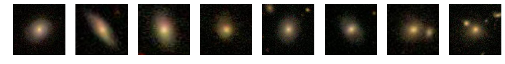

# Kaggle · Galaxy Zoo

An early deep learning project from 2019, preserved from my first experiments with Python and computer vision. For Kaggle's Galaxy Zoo challenge, I adapted an **AlexNet-style convolutional network** in Keras/TensorFlow to predict 37 galaxy morphology probabilities from images, experimenting with cropping, data augmentation, dropout, and batch normalization.

*Original sample images saved in [MyNet.ipynb](MyNet.ipynb).*

Explore [cropping](Crop_images.ipynb), [model training](MyNet.ipynb), and [evaluation and submission](Evaluation.ipynb). Saved weights and experiment notes are in [results_and_weights](results_and_weights/).

The original notebooks are unchanged; rerunning them requires the Kaggle data, updated local paths, and compatible older dependencies.
